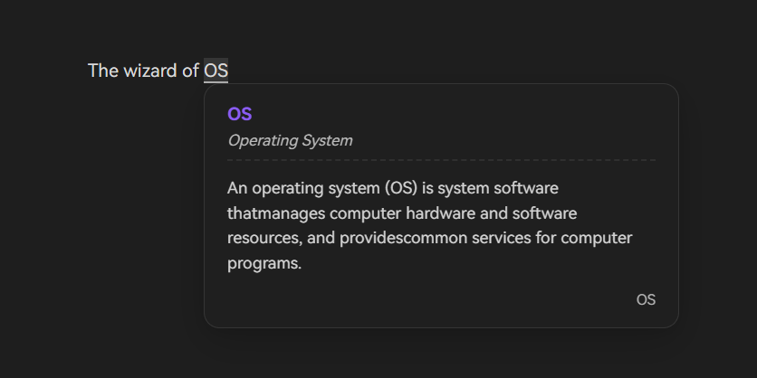

# Obsidian Note Definitions（中文文档）

中文文档｜[English Doc](https://github.com/likemuuxi/obsidian-note-definitions/blob/master/README.md)

> 本仓库是 [dominiclet](https://github.com/dominiclet/obsidian-note-definitions) 的社区维护分支。功能仍在测试期，可能会有调整。

一个在笔记中快速查词的「个人词典」插件。



## 基本用法

1. 创建一个文件夹，右键该文件夹选择 `Set definition folder`，将其注册为「定义文件夹」。
2. 在该文件夹中创建任意名称的定义文件。
3. 通过 `Add definition` 命令新增定义，会弹出对话框录入内容。
4. 添加后，笔记里的词/短语会带下划线。鼠标悬停或在光标处调用 `Preview definition` 命令即可预览定义。

### 编辑器菜单

- 跳转到定义
- 添加定义（需先选中文本）
- 编辑定义（右键下划线处）

### 命令

建议给常用命令绑定热键：

- Note Definitions: Add definition（添加定义）
- Note Definitions: Go to definition（跳转到定义）
- Note Definitions: Preview definition（预览定义）
- Note Definitions: Refresh definitions（刷新定义）
- Note Definitions: Add definition context（见下文 [Definition context](#definition-context)）
- Note Definitions: Open Definition Sidebar（打开定义侧边栏）
- Note Definitions: Open Definition Manager（打开定义管理界面）
- Note Definitions: Register atomic definition file（注册原子类型）
- Note Definitions: Register consolidated definition file（注册联合类型）

## 工作原理概览

插件不使用隐藏元数据，所有定义都存放在你的仓库里。定义写入「定义文件」后会出现在文档中；手动编辑也可以，但需遵守定义规则（见下文）。

### 定义文件类型与规则

定义文件有两种类型：`consolidated` 与 `atomic`，通过前言区(frontmatter)属性 `def-type` 指定。未指定时不进行识别。
为方便起见，请使用所提供的命令和菜单选项来添加 frontmatter 的 `def-type` 内容。

#### Consolidated 定义文件

- 一个文件可包含多条定义。
- frontmatter 添加 `def-type: consolidated`，或在文件激活时执行 `Register consolidated definition file`。
- 解析规则：
  1. 一个定义块包含 **词/短语、可选别名行、定义正文**，顺序固定。
  2. 词/短语行格式：`# <PHRASE>`。
  3. 可选别名行：星号包裹的逗号分隔列表，如 `*alias*`（会显示为斜体）。
  4. 之后的行视为定义正文，直到分隔符出现；你可以在此处编写 Markdown 格式的内容，其格式将与 Obsidian 的 Markdown 格式类似。
  5. 分隔符是仅含 `---` 的一行（可在设置改为 `___`）。

**Consolidated 定义示例:**

> # Word1
> 
> *alias of word1*
> 
> Definition of word1.
> This definition can span several lines.
> It will end when the divider is reached.
> 
> ---
> 
> # Word2
>
> Notice that there is no alias here as it is optional.
> The last word in the file does not need to have a divider, although it is still valid to have one.
> 
> ---
> 
> # Phrase with multiple words
> 
> You can also define a phrase containing multiple words. 
>
> ---
>
> # Markdown support
> 
> Markdown is supported so you can do things like including *italics* or **bold** words.

#### Atomic 定义文件

- 一个文件只含一条定义。
- frontmatter 添加 `def-type: atomic`，或在文件激活时执行 `Register atomic definition file`。
- 解析规则：
  1. 文件名即定义的词/短语。
  2. 别名写在前言区 `aliases` 列表：
     ```yaml
     ---
     aliases:
       - alias1
       - alias2
     ---
     ```
  3. 前言区之后的正文即定义内容。

## 定义上下文（Definition context）

为当前笔记限定可用的定义来源（局部作用域）。默认无上下文，等同于使用全部定义。

### 添加上下文

## 定义上下文

> _TLDR:_“上下文”与定义文件同义。通过指定上下文，您可以指定要使用特定的定义文件来获取当前注释的定义。

定义上下文是指当前活动注释可用的定义存储库。
默认情况下，所有注释都没有上下文（您可以将其视为全局范围）。
这意味着您新创建的注释将始终可以访问定义文件中定义的所有定义的组合。

可以通过指定注释的“上下文”来覆盖此行为。
您拥有的每个定义文件都被视为一个单独的上下文（因此您的定义应该相应地构建）。
一旦为注释声明了上下文，它只会从指定的上下文中检索定义。
您可以将其视为注释的本地范围。
该注释现在只能看到所有定义的有限子集。

### 使用方式

为方便为您的笔记添加背景信息：
  1. 使用 `Add definition context` 命令。
  2. 搜索并选择您所需的背景。
您可进行多次操作以添加多个背景。

### 工作方式

命令会在笔记属性中写入 `def-context`（列表），值是选定定义文件的路径，例如：
```yaml
---
def-context:
  - definitions/def1.md
  - definitions/def2.md
---
```
可手动编辑，但使用命令更省事且不易写错路径。

### 移除上下文

删除 `def-context` 中的路径，或移除整个属性即可。

## 刷新定义

若检测不到某些定义或定义文件，执行 `Refresh definitions` 强制重读。

## 反馈与贡献

欢迎通过 issue 提交问题或建议。如需实现功能也欢迎贡献代码。

# ☕支持一下

[](https://ko-fi.com/Z8Z31JZHLJ)

<a href="https://www.buymeacoffee.com/1204871655e" target="_blank"></a>
